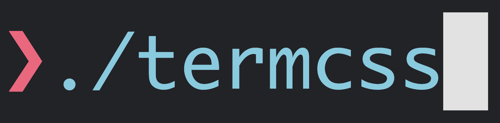

<div align="center">
  
  <div><strong>Downgrading the web to something better™</strong></div>
</div>

<br>

Lots of people are trying to make the terminal look more like a real GUI, but
what people really want is GUIs that look like a terminal.

Enter `termcss`: a modern, vintage CSS framework that aims at bridging the gap
between the terminal and the web by making the web worse.

## Philosophy

### Utility first

`termcss` follows the footsteps of [Tailwind](https://tailwindcss.com/) and
exposes a series of utility classes to style your documents. To a large extent,
these classes use the same names as Tailwind, the main difference being that
there are _a lot_ fewer.

### The Terminal Grid

The golden rule of this framework is that **everything must line up with the
terminal grid at all times, at all costs.**

The most important aspects of this are:

- A monospace font, preferably a [Nerd Font](https://www.nerdfonts.com/#home) so
  we solve the icon problem too.
- The `--row` and `--col` CSS variables that specify the dimensions of a
  character. In a perfect world they would be set to `1lh` and `1ch`, but these
  units are _not_ reliable enough.

Everything else that affects sizes and positions and all that is defined as a
multiple of these variables and nothing else. As long as you stick to the
classes offered here, your text should never, ever go out of whack.

This rule is the main reason so many things are currently missing, such as all
the alignment utilities. They will stay out until we figure out a way to enforce
this rule.

## Usage

There currently is no support for tree shaking, dynamic classes, or all the
other things that make Tailwind good. We also do not have CDN or packages or
anything. We just have a `go` script that generates all the things, and the
`term.css` file that includes all the generated things.

So, if you want to use this, your best bet is to **download the CSS from this
repo and include it in your codebase.**

You can also fork the repo and generate the CSS yourself if you want to tweak or
trim something. If you have `go` installed, just run it:

```sh
go run .
```
